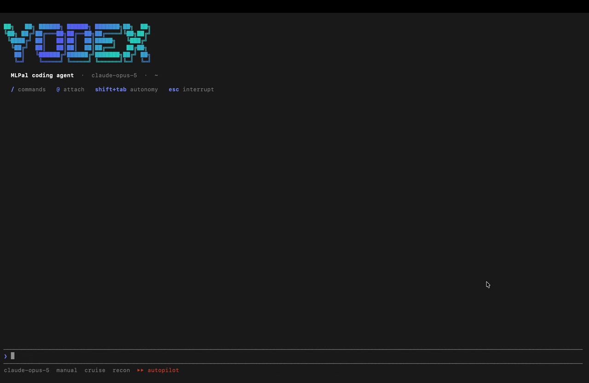
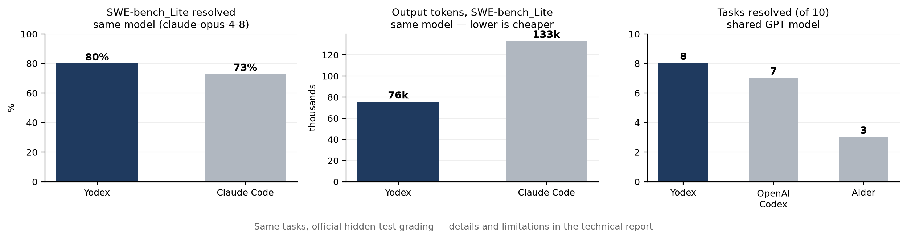

<h1 align="center">Yodex</h1>

<p align="center">
  <b>A provider-agnostic coding agent.</b><br>
  Use Anthropic, OpenAI, Google, and open-weight models through the same agent harness.
</p>

<p align="center">
  <a href="https://www.npmjs.com/package/@mlpal/yodex"></a>
  <a href="paper/yodex-harness-paper-v2.pdf"></a>
  <a href="LICENSE.md"></a>
</p>

```bash
npm install -g @mlpal/yodex
```

Yodex runs coding-agent workflows against any model available through an MLPal Gateway.
Get an API key either way:

- **Managed** — create a key at **[mlpal.ai](https://mlpal.ai)**. Yodex talks to
  `https://models.mlpal.ai` by default; the key is all you need.
- **Self-hosted** — run the open-source
  [MLPal Gateway](https://github.com/mlpal-ai/mlpal-gateway) with your own
  provider keys (`docker compose up`), mint a key in its console, and point
  Yodex at your box: `export YODEX_GATEWAY_URL=http://localhost:8000`.

```bash
export YODEX_API_KEY=mlpal_sk_...

yodex "explain this repository"
yodex "fix the failing tests"
yodex "find the cause of this regression and patch it"
```

Choose a specific model:

```bash
yodex --model claude-opus-5 "review this implementation"
```

or let Yodex work with model tiers and routing:

```bash
yodex --model cheap "update these imports"
yodex --model frontier "debug this concurrency issue"
yodex --model mlpal "fix this issue"
```

<p align="center">
  
</p>

> **Repository note:** The Yodex CLI is distributed through [npm](https://www.npmjs.com/package/@mlpal/yodex); its source is not published in this repository.
>
> This repository contains documentation, benchmark results, the technical report, and the public issue tracker.

## What it does

Yodex provides the agent loop around the model: tool use, context management, verification, delegation, recovery, permissions, and multi-agent execution.

The harness itself is provider-independent.

### Model routing

Run a specific model or use stable tiers:

```text
max
frontier
mid
cheap
```

Tier mappings are maintained by the gateway rather than hard-coded into the Yodex client.

### Delegation

Yodex can break work into sub-tasks and run them on different model tiers.

For example, repository search or mechanical edits can run on cheaper models while harder reasoning is routed to stronger models.

### Verification

Yodex supports:

* edit-triggered self-checks
* optional secondary verification
* anti-churn protection for repeated unsuccessful edits

### Tool policy

Read, write, edit, and shell operations pass through deterministic policy checks before permission handling.

These checks do not depend on an LLM deciding whether an operation is allowed.

### Parallel and background execution

Independent tool calls and sub-agents can execute concurrently.

Background agents, shells, and monitors report back into the active session.

### Cross-repository agents

Sessions can share a common store.

An agent working in one repository can send a self-contained task to an agent working in another repository and receive the result through a mailbox.

### Extensions

Yodex supports:

* MCP servers
* skills
* Claude Code-compatible plugin packages

## Benchmarks

We primarily evaluate Yodex using **same-model isolation**: Yodex and the comparison agent use the same underlying model, so differences measure the agent harness rather than the model.

Same model: `claude-opus-4-8`

| Task tier               |     Yodex | Claude Code | Output tokens (CC/Y) | Wall clock (CC/Y) |
| ----------------------- | --------: | ----------: | -------------------: | ----------------: |
| Easy (18)               |     18/18 |       18/18 |                1.49× |             1.63× |
| Hard (14)               |     14/14 |       13/14 |                1.18× |             1.35× |
| Long (6)                |       6/6 |         6/6 |                1.65× |             1.72× |
| **SWE-bench_Lite (15)** | **12/15** |   **11/15** |            **1.76×** |         **1.59×** |

`CC/Y` means Claude Code divided by Yodex — `1.76×` output tokens means Claude Code produced 1.76× as many output tokens.

<p align="center">
  
</p>

The [technical report](paper/yodex-harness-paper-v2.pdf) also covers Yodex vs OpenAI Codex and Aider on a shared GPT model, the same harness on cheaper models (correctness held at 7.7–10.1× lower cost), a budget router (matched the premium baseline at 3.08× lower cost), and per-instance divergent patch analysis.

Follow-up runs on `claude-opus-5`:

* [Harness comparison and delegation](benchmarks/vs-claude-code-opus5.md) (July 2026) — equal correctness on focused fixes at ~1.6–1.8× lower cost; ~10× lower sub-agent cost via catalog routing.
* [SWE-bench recheck](benchmarks/swe-recheck-opus5-2026-08-11.md) (August 2026) — 2/2 vs 2/2 resolved; ~2× fewer output tokens, ~6× lower compute cost.

These are experiments conducted by the Yodex authors, some at small sample sizes. Each report includes methodology, raw results, limitations, and the authors' conflict of interest.

## How Yodex works

A coding agent combines a model with a system around it:

```text
                   ┌───────────────┐
                   │     Yodex     │
                   │               │
                   │ Agent loop    │
                   │ Tools         │
                   │ Context       │
                   │ Verification  │
                   │ Delegation    │
                   │ Permissions   │
                   └───────┬───────┘
                           │
                    MLPal Gateway
                           │
          ┌────────────────┼────────────────┐
          │                │                │
      Anthropic         OpenAI           Google
          │                │                │
          └──────── Open-weight models ─────┘
```

The harness communicates with the gateway using one model interface.

Provider-specific model integrations, model availability, and tier mappings are handled by the gateway.

This means the agent loop does not need to change when the underlying model changes.

## Why separate the harness from the model?

Coding-agent performance depends on more than model capability.

The surrounding system determines:

* which context reaches the model
* when tools are called
* how changes are verified
* how failures are handled
* when work is delegated
* which model handles each sub-task
* how much inference is consumed to complete the task

Most model evaluations keep this surrounding system fixed and compare models.

Yodex explores the opposite question:

> **What happens when the model is held fixed and the harness changes?**

That is the motivation behind the same-model experiments in our technical report.

## Technical report

📄 **[Decoupling the Harness from the Model](paper/yodex-harness-paper-v2.pdf)**
*Yodex Team · MLPal Research*

The report covers:

* same-model isolation
* official SWE-bench grading with hidden tests
* harness comparisons (Claude Code, OpenAI Codex, Aider, OpenCode)
* token and latency measurements
* model routing and delegation
* divergent patch analysis
* evaluation limitations

## Gateway

Yodex requires an MLPal Gateway.

You can use the managed gateway or run one yourself.

### Managed

```bash
export YODEX_API_KEY=mlpal_sk_...
yodex "fix the failing test"
```

Keys can be created at [mlpal.ai](https://mlpal.ai).

### Self-hosted

The gateway is open source at [github.com/mlpal-ai/mlpal-gateway](https://github.com/mlpal-ai/mlpal-gateway) (Apache-2.0) and can be started with Docker Compose.

```bash
export YODEX_GATEWAY_URL=http://localhost:8000
export YODEX_API_KEY=mlpal_sk_...

yodex "fix the failing test"
```

The managed and self-hosted gateways expose the same API.

Available models depend on the providers configured on the gateway.

## Issues and feedback

Bug reports and feature requests are welcome.

[Open an issue](../../issues/new/choose)

The terminal CLI is available now.

Web and editor interfaces are in development and use the same underlying Yodex engine.

Contact: [contact@mlpal.ai](mailto:contact@mlpal.ai)

## License

© 2026 MLPal Inc. All rights reserved.

See [LICENSE.md](LICENSE.md).

Documentation, benchmark data, and the technical report in this repository may be redistributed unmodified with attribution.
