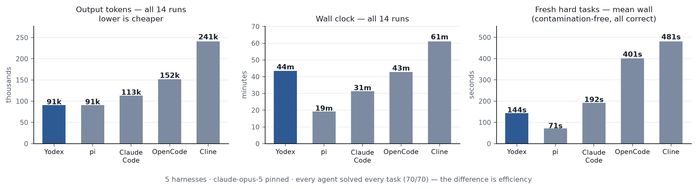

# Five-harness panel on claude-opus-5 (2026-08-13)

Five coding-agent harnesses, one pinned model, seven tasks, two reps each —
70 runs. The question: with the model held fixed, what does each harness cost
in time and tokens?

**Agents** (all headless, full-auto): Yodex 0.7.0 · Claude Code 2.1.229 ·
OpenCode 1.18.17 · pi 0.84.1 · Cline 3.0.53. Model pinned to `claude-opus-5`
in every harness.

**Tasks** (2 easy / 2 medium / 3 hard, provenance labeled):

| Task | Source | Graded by |
|---|---|---|
| ledger (easy) | fresh-authored | hidden pytest suite (5 tests) |
| slugify (easy) | fresh-authored | hidden pytest suite (6 tests) |
| astropy-14182 (medium) | SWE-bench_Lite | official SWE-bench harness, hidden tests |
| scikit-learn-13779 (medium) | SWE-bench_Lite | official SWE-bench harness, hidden tests |
| matplotlib-25311 (hard) | SWE-bench_Lite | official SWE-bench harness, hidden tests |
| thread scheduler (hard) | fresh-authored | hidden concurrency suite (4 tests) |
| rate limiter from spec (hard) | fresh-authored | hidden spec suite (7 tests) |

Fresh tasks were written for this run (no overlap with any public benchmark or
our earlier reports); their hidden suites were verified to fail on the starting
code and pass on an independent reference solution. Agents never see hidden
tests. SWE instances are graded by the unmodified official harness in Docker.

## Result: correctness saturates — every agent solved every task

**70/70.** All five harnesses passed every hidden suite and resolved every
SWE instance, both reps. On this task set, opus-5 makes correctness a
non-differentiator between harnesses. What differs is cost:

| | Yodex | pi | Claude Code | OpenCode | Cline |
|---|--:|--:|--:|--:|--:|
| Output tokens (14 runs) | **91k** | 91k | 113k | 152k | 241k |
| Wall clock (14 runs) | 43.5m | **19.3m** | 31.3m | 42.8m | 61.1m |
| Fresh hard tasks, mean wall | 144s | **71s** | 192s | 401s | 481s |
| Fresh hard tasks, mean output tokens | **10k** | 11k | 15k | 24k | 35k |

## Reading the numbers honestly

- **Token efficiency:** Yodex and pi tie for leanest overall; on the
  contamination-free hard tasks Yodex is leanest. Cline spends 2.6× Yodex's
  tokens for the same outcomes.
- **pi is genuinely fast** — and its 8–9 second scikit-learn runs (near-zero
  tokens, identical both reps) are almost certainly a memorized patch for a
  public instance. The official grader accepts it (the fix is correct), but the
  fresh tasks are the fairer speed read: pi leads there too, at 71s.
- **Yodex's wall-clock on the big SWE repos is verification, not wandering.**
  Trace example (matplotlib): the fix landed 70 seconds in; the remaining ~5
  minutes built the repo's C extensions and reproduced the bug before and after
  the change. Claude Code asserted correctness without a build and saved the
  time. Same patch, different evidence standard — Yodex's verification ladder
  is configurable if you prefer speed.
- **Where all harnesses were forced to actually work** (the fresh hard tasks),
  the spread is wide: 71s–481s wall and 10k–35k tokens for identical outcomes —
  a 6.8× time and 3.5× token range from harness design alone.

## Method and limitations

One AWS m7i.4xlarge (16 vCPU / 64GB), three isolated lanes: Claude Code on its
own subscription auth, Yodex through the MLPal gateway, and the API-key agents
(OpenCode, pi, Cline) serialized on one Anthropic key so they never contend for
rate limits. Same model ID everywhere, but serving stacks differ per lane —
same protocol as our August recheck. N=2; single-cell differences are noise.
Tasks 7; authored tasks written by the Yodex authors; the whole panel was run
by the Yodex authors — weight the conflict of interest accordingly. An earlier
attempt on an 8GB box hit OOM during repo test suites and was discarded
entirely; all numbers here come from the clean 64GB run. Full traces, patches,
per-run metrics, and grading outputs are archived.
